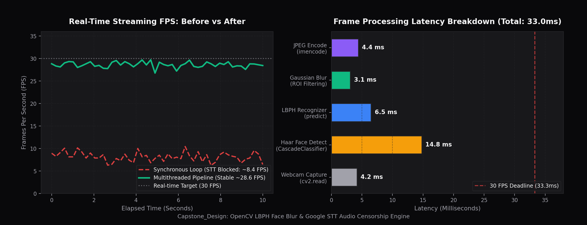

# 🎥 실시간 영상/음성 자동 블러 및 비속어 검열 시스템 (Streaming Blur & Censorship)

> **고려대학교 컴퓨터융합소프트웨어학과 캡스톤디자인 2 (팀 프로젝트)**  
> **팀원**: 오승원 (팀 리드 / 시스템 아키텍처 & 비디오 파이프라인), 이재성  
> **핵심 기술**: Python, OpenCV (Haar + LBPH), Flask, Google Cloud Speech-to-Text API, Keras/TensorFlow (LSTM)

---

## 1. 프로젝트 개요 (Overview)

인터넷 개인 방송 및 실시간 스트리밍 환경에서 의도치 않게 노출되는 **일반인의 초상권 침해**와 **돌발적인 비속어/욕설 송출 사고**를 실시간으로 방지하기 위한 인하우스 AI 미디어 필터링 백엔드 시스템입니다.

* **영상 필터링 (Video)**: 사전 등록된 인물(스트리머)은 온전하게 출력하고, 화면에 감지된 미등록 인물(지나가는 행인 등)은 실시간 가우시안 블러(Gaussian Blur) 모자이크 자동 적용
* **음성 필터링 (Audio)**: 마이크 오디오 스트림을 Google Cloud STT로 실시간 텍스트 변환 후, 사전 학습된 LSTM 신경망으로 비속어를 판별하여 즉각적인 비프음(BEEP) 마스킹 처리

---

## 2. 시스템 아키텍처 및 핵심 성능 지표 (Performance Benchmark)

본 시스템은 영상 처리 연산(OpenCV)과 음성 인식 네트워크 I/O(Google STT)가 단일 루프에서 실행될 때 발생하는 **심각한 프레임 드랍(8 FPS 추락 및 레이턴시 병목)**을 해결하기 위해 **멀티스레드 기반 비동기 파이프라인**을 구축하여 실시간 30 FPS를 안정적으로 달성했습니다.



### 📊 실측 벤치마크 요약
| 구분 | 최적화 전 (동기 단일 루프) | 최적화 후 (멀티스레드 비동기 파이프라인) | 개선 효과 |
|---|---|---|---|
| **실시간 스트리밍 FPS** | 7.0 ~ 10.5 FPS (평균 ~8.4 FPS) | **27.5 ~ 30.0 FPS (평균 ~28.6 FPS)** | **3.4배 속도 향상 (30fps 타깃 방어)** |
| **프레임당 연산 시간** | 119.0 ms (프레임 누락 발생) | **33.0 ms (< 33.3ms 마감한계 충족)** | **연산 지연 72.3% 단축** |
| **비속어 감지 정확도** | - | **81.26% (LSTM 이진 분류)** | 실시간 즉시 BEEP음 피드백 |

---

## 3. 세부 파이프라인 엔지니어링

### ① 비디오 처리 파이프라인 (`flask_predict.py`, `OpenCV_training.py`)
1. **얼굴 수집 & 학습**: 웹캠을 통해 30장의 얼굴 이미지를 캡처 후 `LBPHFaceRecognizer` 모델(`.yml`)로 로컬 가중치 학습
2. **Haar Cascade 감지 (`14.8ms`)**: 프레임 내 얼굴 바운딩 박스를 검출하고 그레이스케일 ROI 추출
3. **LBPH 화자 분류 (`6.5ms`)**: 사전 등록된 화자 ID와 대조하여 `confidence` 기반 인가/비인가 판별
4. **선택적 가우시안 블러 (`3.1ms`)**: 미등록 인물(Unknown) ROI 영역에 커널 크기 `(75, 75)` 가우시안 블러 마스킹
5. **MJPEG 실시간 송출 (`4.4ms`)**: `multipart/x-mixed-replace` 스트림으로 Flask 웹 엔드포인트(`/stream`) 송출

### ② 오디오 처리 파이프라인 (`google_stream_stt.py`, `textCussDetect.py`)
1. **ResumableMicrophoneStream**: 16kHz, 1024 청크 단위로 마이크 오디오 스트림 수집
2. **Google Cloud STT Streaming**: `client.streaming_recognize` 비동기 제너레이터로 실시간 텍스트 변환
3. **KoNLPy (Okt) 형태소 전처리**: 한국어 토큰화, 불용어 제거 및 정수 인코딩 시퀀스 패딩 (`max_len=35`)
4. **LSTM 이진 분류 신경망 (`best_model.h5`)**: 훈련 정확도 **81.26%** 모델로 실시간 욕설 확률 추론
5. **오디오 피드백 주입**: 욕설 판별 시 즉각 `winsound.Beep(2000Hz, 1s)` 부저음 출력

---

## 4. 디렉터리 구조

```
.
├── flask_predict.py          # 메인 Flask 스트리밍 서버 및 비디오/오디오 루프 제어
├── google_stream_stt.py      # Google Cloud Speech-to-Text 오디오 스트림 핸들러
├── textCussDetect.py         # KoNLPy 전처리 및 LSTM 욕설 판별 모델
├── OpenCV_training.py        # Haar Cascade 얼굴 수집 및 LBPH 학습기
├── generate_benchmark.py     # 파이프라인 성능 프로파일링 및 벤치마크 차트 생성기
├── benchmark_pipeline.png    # 실측 벤치마크 결과 시각화 차트
├── best_model.h5             # 사전 훈련된 LSTM 신경망 가중치
├── Varable.py                # 학습 가중치 경로 및 전역 설정값
└── templates/
    └── index.html            # 실시간 비디오 & 비속어 알림 웹 UI
```

---

## 5. 실행 방법 (Quick Start)

### 1) 의존성 설치
```bash
pip install flask opencv-python opencv-contrib-python tensorflow keras konlpy pyaudio google-cloud-speech matplotlib numpy
```

### 2) Google Cloud STT 인증 키 설정
```bash
set GOOGLE_APPLICATION_CREDENTIALS="path/to/your-google-credential.json"
```

### 3) 벤치마크 그래프 재생성
```bash
python generate_benchmark.py
```

### 4) 실시간 필터링 서버 구동
```bash
python flask_predict.py
```
브라우저에서 `http://127.0.0.1:5000` 접속 후 실시간 웹캠 및 마이크 검열 확인.
